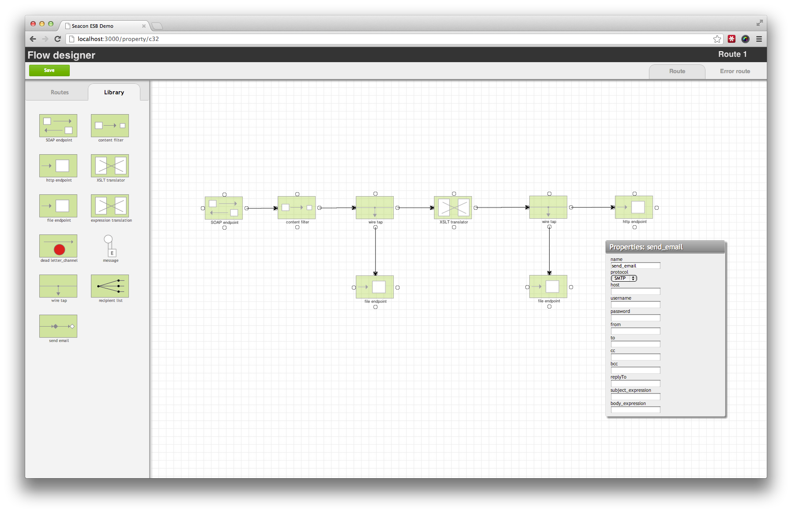
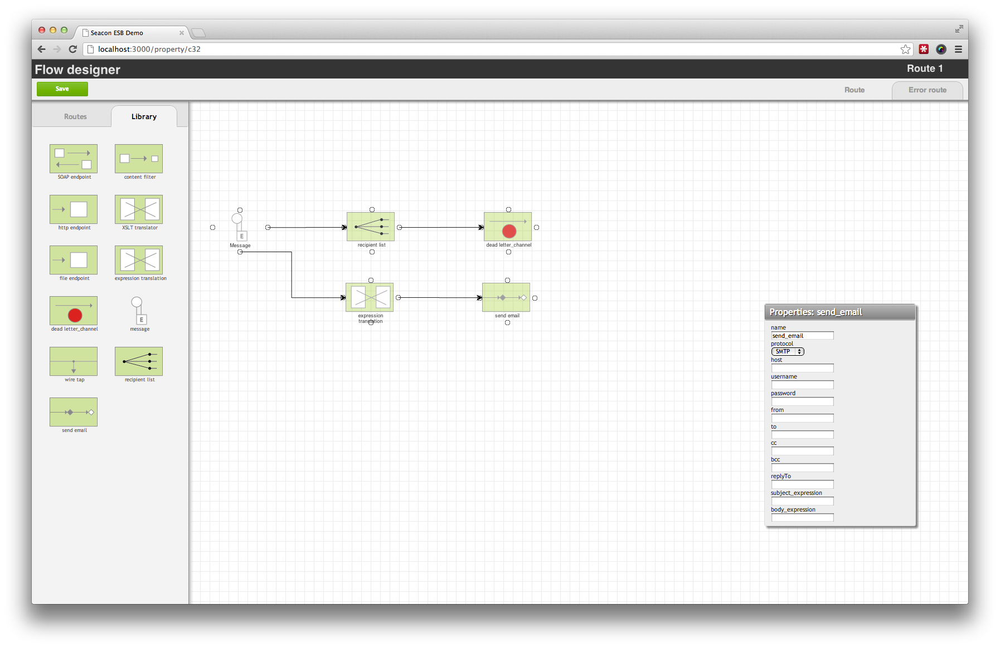

# Flow Designer prototype

This is the result of a 2 day hackaton to build a prototype flow desinger for Enterprise Integration Patterns (Apache Camel).

Tools/Libs used:

	- Ruby 1.9.3
	- Rails 2.3
	- Backbone.js
	- JSPlumb
	- JQuery
	- JQuery UI
	- Coffeescript

